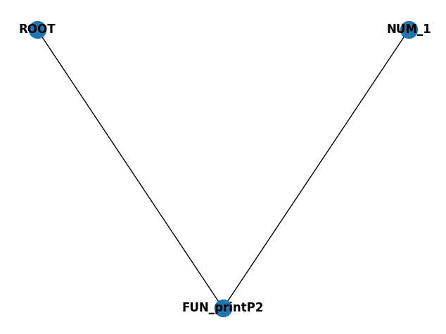

# Language definition
## Rules
Below, the rules for the defined language in our parser. In BNF notation:
```BNF
<S'>          ::= <assignment>

<assignment>  ::= VARIABLE SETTO <expression>
                | VARIABLE SETTO <list>
                | VARIABLE SETTO <flow>
                | <expression>

<flow>        ::= VARIABLE CONNECT <flow_functions>

<flow_functions> ::= <flow_function_call> CONNECT <flow_functions>
                    | <flow_function_call>

<flow_function_call> ::= VARIABLE LPAREN <params> RPAREN

<element>     ::= <expression>
                | <list>

<elements>    ::= <elements> COMMA <element>
                | <element>

<expression>  ::= VARIABLE LBRACKET <index> RBRACKET
                | VARIABLE LBRACKET <index> CASE <index> RBRACKET
                | VARIABLE LBRACKET <index> CASE RBRACKET
                | VARIABLE LBRACKET CASE <index> RBRACKET
                | VARIABLE LBRACKET <index> RBRACKET SETTO <expression>
                | VARIABLE LBRACKET <index> CASE <index> RBRACKET SETTO <expression>
                | VARIABLE LBRACKET <index> CASE RBRACKET SETTO <expression>
                | VARIABLE LBRACKET CASE <index> RBRACKET SETTO <expression>
                | VARIABLE APPEND LPAREN <expression> RPAREN
                | VARIABLE POP LPAREN RPAREN
                | <expression> PLUS <term>
                | <expression> MINUS <term>
                | <term>
                | <string>
                | <expression> EQUALS <expression>
                | <expression> NEQUALS <expression>
                | <expression> LEQUALS <expression>
                | <expression> GEQUALS <expression>
                | <expression> LESS <expression>
                | <expression> GREATER <expression>
                | <expression> AND <expression>
                | <expression> OR <expression>
                | NOT <expression>
                | LPAREN <expression> RPAREN TERNARY <expression> CASE <expression>
                | IF LPAREN <expression> RPAREN CASE <expression>
                | ELIF LPAREN <expression> RPAREN CASE <expression>
                | ELSE CASE <expression>

<index>       ::= NUMBER

<params>      ::= <params> COMMA <expression>
                | <expression>

<list>        ::= LBRACKET RBRACKET
                | LBRACKET <elements> RBRACKET

<string>      ::= STRING

<term>        ::= <term> TIMES <exponent>
                | <term> DIVIDE <exponent>
                | <exponent>

<exponent>    ::= <factor> EXP <factor>
                | <factor>
                | LPAREN <expression> RPAREN
                | <factor>

<factor>      ::= NUMBER
                | VARIABLE
                | <function_call>

<function_call> ::= VARIABLE LPAREN RPAREN
                  | VARIABLE LPAREN <params> RPAREN
```
\<__S'__> (start symbol) is an assignment.
\<__assignment__> can be a variable set to an expression, list, flow, or directly to an expression.
\<__flow__> represents a flow defined by a variable connected to flow functions.
\<__flow_functions__> can be a single flow function call or a sequence of connected flow function calls.
\<__flow_function_call__> is a variable followed by parameters in parentheses.
\<__element__> can be an expression or a list.
\<__elements__> is a sequence of elements separated by commas.
\<__expression__> represents various forms of expressions, including variable indexing, list operations, arithmetic operations, comparisons, logical operations, and function calls.
\<__index__> is a number used for indexing.
\<__params__> are parameters passed to functions.
\<__list__> can be an empty list or a list of elements enclosed in square brackets.
\<__string__> represents a string literal.
\<__term__> represents multiplication, division, or a single exponent.
\<__exponent__> represents exponentiation or a single factor.
\<__factor__> can be a number, variable, or function call.
## Functions
This program provides three Python scripts with the following functions and behaviors:
- `library.py`: 
  As it name suggests, defines a library of predefined functions to handle numpy classes and functions, as well as OpenCV image manipulation; which are then provided in the __Symbol Table__ for the lexer.
  - __load_image(path: str) -> np.ndarray__: Loads an image from the specified path using OpenCV (cv2.imread) which returns an np.ndarray.
  - __save_image(filename: str, image: np.ndarray) -> None__: Saves an image to a file using OpenCV (cv2.imwrite). The first parameter is the filename to save the image, while the image parameter is the image itself.
  - __show_image(img: np.ndarray) -> np.ndarray__: Displays the provided image in a window using OpenCV (cv2.imshow).
  - __search_cv2(function_name: str)__: Searches for a function in the cv2 module by name and returns it using getattr.
  - __gen_matrix(a: int, b: int, *args: float) -> np.ndarray__: Generates a NumPy matrix of dimensions a x b filled with values provided in args.
  - __gen_vector(*args: float) -> np.ndarray__: Generates a NumPy vector from the provided arguments.
- `lexer.py`:
  - Language Predefined Functions
    - __printP() -> None__: Prints 'Hello World' (Simply for demonstration purposes).
    - __printP2(num: int) -> None__: Prints "Hello, World! " followed by the input number.
  - Parse Tree Functions
    - __add_node(attr: dict) -> dict__: Adds a node to the parse graph with specified attributes.
    - __execute_parse_tree(tree: nx.Graph) -> None__: Executes the parse tree and evaluates the nodes.
    - __visit_node(tree: nx.Graph, node_id: int, from_id: int) -> any__: Visits a node in the parse tree and performs evaluation.
  - __t___ definitons: Generally specify tokenization rules for input text. Each one corresponds to a regular expression pattern that matches certain tokens in the input text. ("Rules" Section for reference)
  - __p___ definitions: Generally specify parsing rules for tokens generated by the lexer. ("Rules" Section for reference)
- `lex_runner.py`:
  - __run_lex_file(file_path: str) -> None__: Reads the content of the specified file, parsed the data using the parser defined in the lexer script, constructas, generates a visualization (if enabled), and executes the parse tree.
  - __main() -> None__: Displays a menu for selecting a file to process. Lists available .lex files from a specific directory, prompts the user for file selection, and runs the run_lex_file function on the selected file.

## Demonstration
In this section, each use case showcases how the lexer and associated functionalities can be applied in practice. The examples cover native functionalities like operator precedence, function calls, and variable assignment, as well as additional capabilities such as working with lists, conditions, and file reading.
### Native Functionalities
- __Operator Precedence__
  ```bash
  > 2 + 3 * 4 - 5 / 1

  Result: 9.0
  ```
  

  This example demonstrates the correct handling of operator precedence in arithmetic expressions. The expression 2 + 3 * 4 - 5 / 1 evaluates to 9.0, showcasing that multiplication and division take precedence over addition and subtraction.

- __Function Calls__
  ```bash
  printP2(1)

  Hello World! 1
  ```
  

  Here, function printP2 is called with the argument 1. The output Hello World! 1 demonstrates the functionality of invoking predefined functions with arguments.

- __Variable Assignment__
  ```bash
  phi = 1.61803398875
  ```
  
  ```bash
  phi

  Result: 1.61803398875
  ```
  This test assigns the value 1.61803398875 to the variable phi. Subsequent usage of phi will refer to this assigned value.

- __Image Manipulation Flows__
  ```bash
  x = load_image('images/test.jpg')

  [array([[[252, 243, 233],
  [252, 243, 233],
  ...
  [125, 121, 102],
  [126, 122, 103]]], dtype=uint8)]

  show_image(x)
  ```
  

  This example demonstrates loading an image from a file ('images/test.jpg') into a variable x, which results in a pixel array. The subsequent show_image(x) function call visualizes this image.

- __OpenCV filter application__
  ```bash
  y = blur(x, gen_vector(10,10))
  ```
  

  An OpenCV filter (blur) is applied to the image x using a generated vector. The result is stored in y.
  ```bash
  show_image(y)
  ```
  

    The filtered image y is then displayed using show_image.

### Complimentary Functionalities
- __Lists and matrices__
  - Variable Assignment
    ```bash
    grades = [10.0, 10.0, 7.5, 6.0]
    ```
    

    An array of grades is assigned to the variable grades.

  - Matrix (2x2 list)
    ```bash
    filter = [[0,125,0],[0,255,0],[0,125,0]]
    ```
    

    A 2x2 matrix (list of lists) is created and assigned to filter.

  - Indexing
    ```bash
    grades[1]
  
    Result: 10.0
    ```
    

    Accessing grades[1] retrieves the value 10.0 from the list grades.

  - Slices
    ```bash
    grades[1:3]
  
    [10.0, 7.5]
    ```
    

    Accessing grades[1:3] retrieves the values from indices 1 through 2 (exclusive of index 3): [10.0, 7.5].

    ```bash
    grades[2:]
  
    [7.5, 6.0]

    grades[:2]

    [10.0, 10.0]
    ```
    - grades[2:]: Retrieves values from index 2 to the end of the grades list: [7.5, 6.0].
    - grades[:2]: Retrieves values from the beginning of the grades list up to (but not including) index 2: [10.0, 10.0].


  - Index reassignment
    ```bash
    filter[1][1] = 0
    ```
    Modifying an element within the filter matrix to 0 at position [1][1].

    
    ```bash
    filter

    [[0, 125, 0], [0, 0, 0], [0, 125, 0]]
    ```
    The updated filter matrix is displayed, showing the modification.

  - Append Values
    ```bash
    grades.append(6.6)

    [10.0, 10.0, 7.5, 6.0, 6.6]
    ```
    The append() method is used to add a new element (6.6 in this case) to the end of the grades list. After executing grades.append(6.6), the grades list is updated to include the new value, resulting in [10.0, 10.0, 7.5, 6.0, 6.6]. This demonstrates how to dynamically add elements to a list in Python using the append() method.

  - Pop Values
   ```bash
    grades

    [10.0, 10.0, 7.5, 6.0, 6.6]

    grades.pop()

    Result: 6.6
    ```
    The pop() method is called on the grades list without specifying an index. When you call grades.pop(), it removes and returns the last element of the list, which is 6.6.
    ```bash
    grades

    [10.0, 10.0, 7.5, 6.0]
    ```
    After applying grades.pop(), the list grades is updated, and the element 6.6 is removed from the end of the list. Therefore, the updated grades list is [10.0, 10.0, 7.5, 6.0].

- __Conditionals__
  ```bash
  a = 10
  b = 5
  c = 2
  ```
  Variables a, b, and c are assigned values for use in conditional statements.

  - Logical Operators
    ```bash
    ((a == 10) && (a == (b * c)))

    1
    ```
    

    Evaluates a logical expression using && (AND) operator.

  - Single Ternary Operator
    ```bash
    ((a <= c) || (b == (a/2))) ? (b * 100) : (c)

    Result: 500
    ```
    !demonstrations/(image-11.png)
    Demonstrates a single-line ternary operation based on conditional logic.

  - Nested Operators
    ```bash
    today = 4
    (today <= 3) ? ((today <= 1) ? ((today == 0) ? 0 : 1) : ((today == 2) ? 2 : 3)) : ((today <= 5) ? ((today == 4) ? 4 : 5) : 6)

    Result: 4
    ```
    

    Illustrates nested conditional operations to determine a specific value based on today's value.

## Personal Conclusions
Vínculos a videos de reflexión de cada participante. Deberán ser privados y solo permitir el acceso a jose.c.mondragon@gmail.com